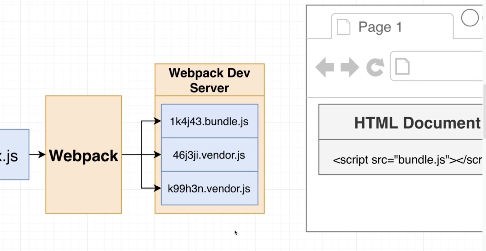

# Microfrontends

Microfrontend Proof of Concept

## Subprojects - Products

This file describes how things work in detail, taking an incremental development process followed throughout the course.

### Goals

We want to be able to run our projects **both in isolation and in the container app** as well.

We aslo want to create components or an app that we will "import" into our container app (or test in isolation)


### Implementation

#### Step 1 - Bundle code

because browsers do not have support for import statements

and because we have more than a single javascript file, we need to bundle those files together. We will use Webpack to do this.

The following image depicts this situation:


>**So step one is to bundle our code using webpack.**

Bundling means combining many JS files into one single file.


#### Step 2 - Execute our bundle in the browser

We need our code to generate some html that gets displayed on the screen.

>**NOTE:** If we were making an analytics widget that did not render to the screen, we would still want to execute it in the browser.

So in development we do this by serving (hosting) our app (widget) using webpack dev server:

```js
// webpack.config.js
devServer: {
  port: 8082,
},
```

We also need to to create an npm script to run our server in paqckage.json:

```json
// package.json
"start": "webpack serve"
```

But this alone will serve the **contents** of the `javascript` file in the browser. But we dont want to see the contents, we want to **run** the file.

#### Step 3 - Creating an HTML file

To run the file, we need to create an HTML file and then reference this `bundle.js` file using a script tag.

>**NOTE:** We will not try to manually reference that file using webpack. Instead we will get webpack figure out how to add that script inside of here for us.

The reason we do that is because we will configure webpack to spit out multiple files with unpredictable names:



Instead we will use a plugin called HtmlWebpackPlugin

```js
// webpack.config.js
new HtmlWebpackPlugin({
  template: './public/index.html'
}),
```

So our html document will actually look like this:

```html
<!DOCTYPE html>
<html lang="en">
<head>
</head>
<body>
  <div id="dev-products"></div>
</body>
</html>
```

If you notice it has no script tag. NOTHING. HtmlWebpackPlugin will add the script tag behind the scenes.

Then, if we visit the address in our browser where it is being hosted (in this example it is `http://localhost:8082`) we will get the html file we specified and modified from webpack.


#### Step 4 - Render our content to the HTML file

In order to see our list of products that we generated in our project, we need to set the `innerHTML` of the div in our html file.

We do this in our js code:

```js
let products = '';

for (let i = 0; i < 5; i++) {
  const name = faker.commerce.productName();
  products += `<div>${name}</div>`;
}

document.querySelector('dev-products').innerHTML = products;
```

### Integrating our container app with a micro frontend

So now we want to make use of some code from `products` in our container project; We need to setup our integration process.


In order to integrate our projects we will go through a series of steps as follows:


#### Step 1 - decide host and remote(s)

This is more of a thought exercise and does not require any coding.

**Host**: `container`

**Remote**: `products`

#### Step 2 & 3 - Setup Module Federation Plugin in the remote

The first action we need to take is to setup the module federation plugin in both our Remote (products) and Host (container) projects.

**Remote Setup:**
```js
// products webpack.config.js
module.exports = {
  // ...
  plugins: [
    new ModuleFederationPlugin({
      // required and must match the string before the '@' symbol in the container remotes value (not the key. { key: value })
      name: 'products',
      // the name of the manifest file. No need to ever change this.
      filename: 'remoteEntry.js',
      // controls which modules / files we will expose to the outside world.
      exposes: {
        // so if someone tries to import something called ProductsIndex we want to give them the index file under src.
        './ProductsIndex': './src/index',
      },
    }),
  ],
};
```

#### Step 4 & 5 - Setup Module Federation Plugin in the host

**Host (Container) Setup:**
```js
const ModuleFederationPlugin = require('webpack/lib/container/ModuleFederationPlugin');

module.exports = {
  // ...
  plugins: [
    new ModuleFederationPlugin({
      // not needed for host. only added for clarity
      name: 'container',
      // tells webpack where to load a module from. more details below.
      remotes: {
        // the key determines how you will later write your import statements. import 'products/ProductsIndex';
        products: 'products@http://localhost:8081/remoteEntry.js',
        cart: 'cart@http://localhost:8082/remoteEntry.js',
      },
    }),
  ],
};
```

#### Step 6 - Refactor the host entry point to load asynchronously

In order to do this, we perform 2 steps:

First we move all the code in our `index.js` file to a file called `bootstrap.js`. There is nothing special about this name, we could have called it anything.

Second, in our empty `index.js` file we add a single line:

```js
import('./bootstrap');
```

This is an import **function** call (not an import statement).


#### Step 7 - In Host, import files you need from remote

Again this is a simple **import statement**

```js
import 'products/ProductsIndex';
```

#### Step 8 - Render remote code in the host

The last thing we need to do is actually render the remote code in the host html file by adding an element with the id `dev-products`


```html
<!DOCTYPE html>
<html lang="en">
<head>
</head>
<body>
  <div id="dev-products"></div>
</body>
</html>
```

Finally! Our projects are integrated.

### Understanding Module Federation

When we start up webpack, we are now emitting two different sets of files:


There is the `main.js` or `bundle.js` which allows us to run products stand alone in development.

#### Module Federation Plugin - remote

With the Module Federation Plugin we are also emitting a second set of files:

 - `remoteEntry.js` - This file contains a list of files that are available from this project + dirctions on how to load them.

 - `src_index.js` - This file is a version of src/index.js that can be safely loaded into the browser.
 
 - `faker.js`. - This file is a version of faker.js that can be safely loaded into the browser.

#### Module Federation Plugin - host

On the host we changed how we loaded our code. We added in a `bootstrap.js` file and used the `import` function call in `index.js` but why?


By using the `import()` function call inside of `index.js`, this gives webpack the opportunity to realize that before executing the `bootstrap.js` file, we have to go and fetch some code from the products project.

By the time we actually execute the `bootstrap.js` file, the expectation is that we will have access to the products module and all the dependencies that it requires.

#### The flow when we first navigate to `localhost:8080`

So if we try to understand what is going on as a series of steps:


Webpack understands where to get the code for products because of the `remotes` entry in the plugin config.


#### Module Federation Options - host

There are also some notes above in the code snippet to explain each option.


**Config Options**

 - `name` is not required for the host.

 - `remotes` tells webpack where to load a module from.

 - the `key` for a remote entry determines how you will later write your import statements. import '`products`/ProductsIndex';

 - the `value` is comprised of two parts: the part before the `@` symbol and the part after.
   - the part before MUST match the name property of the remote.
   - the part after is a URL that tells webpack where to fetch the module from.

#### Module Federation Options - remote


**Config Options**

 - `name` is required and must match the string before the '@' symbol in the container remotes value (not the key. { key: value })

 - `filename` the name of the manifest file. No need to ever change this. The container uses this as part of the URL to fetch the module.

 - `exposes` - controls which modules / files we will expose to the outside world. See code snippet for an example.

### The Current Development Process

For each team to develop their projects seperately, these are the steps they follow:


For the container team, they need to make sure all three projects are running, not _just_ the container project.

#### HTML files


 - The html files in the products and cart projects are only used for development.

 - The html file in the container project is used for both development and production.

### Sharing Modules

In our example, both products and cart are making use of the same module: faker. This means our container app loads faker twice (and that is not good because faker is very large). 

We can overcome this issue using Webpack's Module Frederation:


To enable this we just have to add one option to our webpack plugin config for the remotes:

```js
// products webpack config AND cart webpack config
plugins: [
  new ModuleFederationPlugin({
    // ...
    shared: ['faker'],
  }),
  // ...
],
```

#### Async Script Loading

>**NOTE:** This can cause an Error: 'Shared module is not available for eager consumption'

The reason for this is at the current point in time, we do not have a `bootstrap.js` file in our products project. We are loading `index.js` immediately and we expect faker to be available immediately. 

To solve this issue, we need to load our project asynchronously as well using the import function call (`import()`) technique we do in container.

So we:

1. create a `bootstrap.js` file and move all the code we had in `index.js` into `bootstrap.js`.

2. we import bootstrap in `index.js` using a import function call:

**`index.js`**
```js
// This is an import **function** call (not an import statement).
// By using the `import()` function call inside of `index.js`, this gives webpack the opportunity to realize that before executing the `bootstrap.js` file, we have to go and fetch some code from the products project.
import('./bootstrap');
```

**`bootstrap.js`**
```js
import faker from 'faker';

// ...
```

#### Shared Module Versioning

We can work with slightly different versions if we specify it in our `package.json` file. specifically if the dependency we want in each package specifies that we can use more than the exact package version number.

By adding a `^` at the front of a version number we are saying we can use any minor version or any patch version as long as the major version is the same. So in semantic versioning, we specify a version like:

`major.minor.patch`

So if one remote uses `5.1.4` and another uses `5.3.0`, as long as they boht have the `^` at the beginning, it will work to have a single shared module.

```json
"dependencies": {
  "faker": "^5.0.0"
}
```

We could also say we only want to use the same patch version using the `~` char.

For more info on versioning search `semantic versioning`, `npm`.


#### Singleton Loading

In some cases, such as with React, we will get an error if we load multiple versions so we also want to know how to restrict or prevent this behavior.

We can do this by using a different syntax:

```js
// products webpack config AND cart webpack config
plugins: [
  new ModuleFederationPlugin({
    // ...
    shared: {
      react: {
        singleton: true
      },
    },
  }),
  // ...
],
```

### Sub-App Execution Context

If we revisit our requirements we should be able to:

1. Develop each of our projects in isolation and

2. Run each of our projects inside the container project.


Recall that, depending on whether we are running products or cart in isolation vs the container, we are going to be executing our projects with a different html document.

So for the **products** project, we will be using the `products` html file during development. And when we run the **container** during development or production, then our `products` app will use the _container_ html file.

There are some really interesting concerns around this.

If we look at our products `bootstrap.js` file, we have some code and we are making a very big assumption in the following line of code:

```js
// ...

document.querySelector('#dev-products').innerHTML = products;
```

We are assuming that a very particular dom element exists in the html document with the id `dev-products`.

We can make this assumption in our development environment because the team developing products has total control over their html document and they can make that element whatever they want it to be.

```html
<!DOCTYPE html>
<html lang="en">
<head>
</head>
<body>
  <div id="dev-products"></div>
</body>
</html>
```

**However**, the products team, is not the container team. The container team might have a different element with a different name.

#### A Better API

So in order to accomodate these two situations (running the remote project in development and production) we will refactor how we write our remote app to provide a better API to consumers (the container project)

**Situation 1**

In **development**, we are running our project in isolation and we will use our local `index.html` file which definitely has an element with an id of 'dev-products'. In this situation we want to immediately render our app into that element.

**Situation 2**

In **production**, we are running our project in the container app and there is no guarantee that an element with an id of 'dev-products' exists. In this situation we DO NOT WANT to try to immediately render the app.

**Solution**

We will first define a function called `mount` (the name does not matter). The goal of the mount function is to accept a reference to an html element. Inside the `mount` function we will do everything to start up our app and produce some html and render it or display it inside the `el` html element.

```js
const mount = (el) => {
  let products = '';

  for (let i = 0; i < 5; i++) {
    const name = faker.commerce.productName();
    products += `<div>${name}</div>`;
  }

  // render our app's content into the `el` element
  el.innerHTML = products;
};
```

We can call this function in either situation 1 or 2. In fact, this approach can be used with many other frameworks (such as react) as well, not just vanilla javascript.

For **situation 2**, it should be up to the container to decide how, when and where our products application should be displayed on the screen. To facilitate this, we will simply export the `mount` function. By exporting the `mount` function, the container can import the `mount` function and make use of it whenever it wants to.

```js
export { mount };
```

For **situation 1**, we need to check if we are running in development and isolation. To do this, we will first check the `process.env.NODE_ENV` environment variable. This is an environment variable that gets set by webpack because we specified `mode: 'development'` inside our webpack config.

The second check we will make to decide if we are running in isolation, is for a unique or very specific html element. We are assuming our container app does NOT have an html element called 'dev-products' and that we are probably running in isolation.

This _could_ be an issue if the container team have a div with a `dev-products` id though. We can get around this by making a much more unique id than 'dev-products'.

```js
// check for development mode
if (process.env.NODE_ENV === 'development') {
  const el = document.querySelector('dev-products');

  // check for isolation (running on it's own, not in the container)
  if (el) mount(el);
}
```

**Full Example**

Our full solution will look like this:

```js
import faker from 'faker';

const mount = (el) => {
  let products = '';

  for (let i = 0; i < 5; i++) {
    const name = faker.commerce.productName();
    products += `<div>${name}</div>`;
  }

  el.innerHTML = products;
};

// Context #1 - Running in development
if (process.env.NODE_ENV === 'development') {
  const el = document.querySelector('dev-products');

  // we are assuming our container app does NOT have an html element called 'dev-products'.
  // we are probably running in isolation
  if (el) mount(el);
}

// Context #2 - Running from Container
export { mount };
```

#### Refactoring our consumer (container) App

So instead of just importing the app file (which previously rendered immediately on it's own), we need to now import the mount function and eventually call it with a reference to an html element that exists inside the container so the products app knows where to display itself.

One issue you might quickly run into is if you have multiple remote apps that export a mount function, you will get a name clash when you import them into your container. We can get around this by renaming them on the fly during import.

```js
import { mount as productsMount } from 'products/ProductsIndex';
import { mount as cartMount } from 'cart/CartShow';

console.log('container');

productsMount(document.querySelector('#prod-products'));
cartMount(document.querySelector('#prod-cart'));
```

One minor detail we need to take care of is that we are exporting the mount function from our `bootstrap.js` file, not our `index.js` file. So in our `products` webpack config we need to update the file we return when someone asks for the mount function.

**products webpack.config.js**
```js
  plugins: [
    new ModuleFederationPlugin({
      exposes: {
        // './ProductsIndex': './src/index',
        './ProductsIndex': './src/bootstrap',
      },
    }),
  ],
```

#### A pattern for production

This is how we are going to export stuff from our application in general:

We will have some kind of central point inside of our project that is going to define a `mount` function. The mount function is going to be the true startup location of our project. If we call mount, then we are going to create our react application or our angular application and render our application into the `el` element that was passed in.

We will have the same set of checks to see if we are running in development and isolation or production.


## One Big Gotcha

### How Module Federation Works

Whenever our `container` tries to access a remote entry file (`remoteEntry.js`) (through the `webpack.config.js` file), it is going to look in the _remoteEntry file served up from the remote_ for a global variable with name of the `remote` (Which on the container, is set by the part of the string before the `@` in the `remotes` value part of the `key: value` entry):

```js
plugins: [
  new ModuleFederationPlugin({
    name: 'container',
    // specifies remote entry files....
    remotes: {
      // here => it's 'products' before the '@', not the key 'products'
      products: 'products@http://localhost:8081/remoteEntry.js',
      cart: 'cart@http://localhost:8082/remoteEntry.js',
    },
  }),
],

```

A global variable is actually created in the remote's `remoteEntry.js` file by the remote webpack Module Federation plugin for the and is set from the `name` parameter in config:

```js
plugins: [
  new ModuleFederationPlugin({
    name: 'products',
  }),
]
```

### The Issue

However, if you assign an id to an element that is the same as the `name` of the remote and the part of the string in the container's `remotes` value, the browser will also create a global variable with the same value and overwrite the one from module federation and you will get an error message:

>**fn is not a function**

### The Fix

So make sure that you do not have any element inside your html file with an id the same as any of the `remote` names you are importing.

<br />
<br />